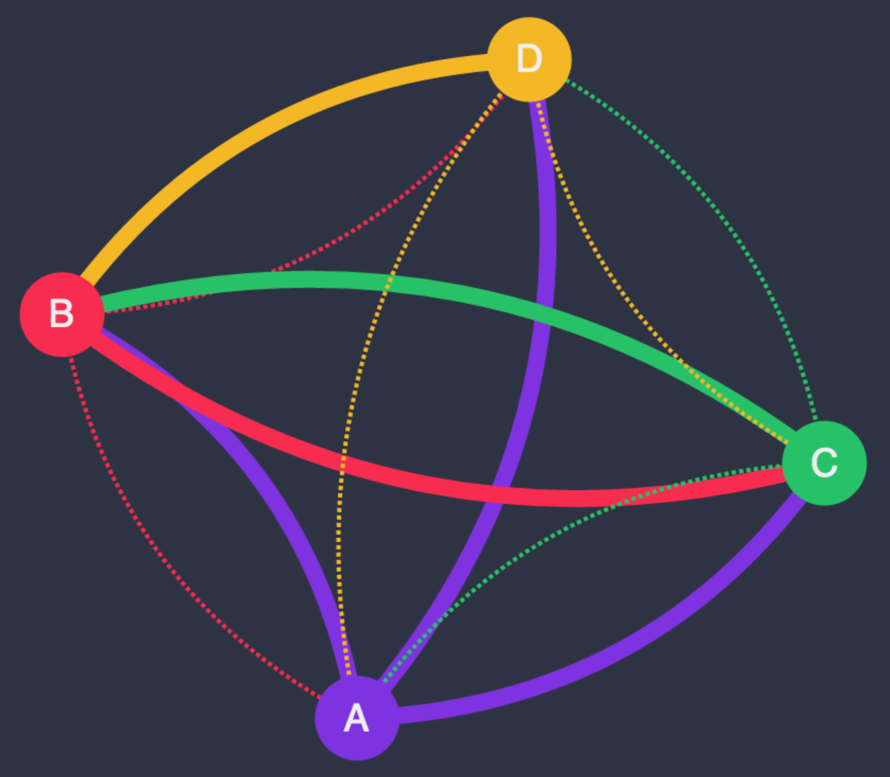

# star 

Star builds two executable programs: _star-probe_ and _star-collect_.

_star-probe_ polls for reachability between endpoints
in a network, exposing the results as a REST resource.

_star-collect_ fetches resources over HTTP and caches them for
retrieval.  It exposes the cached results as a REST resource.  In
addition, resources can be added and removed via the REST API.

The _star-collect_ program also has a web UI for visualizing probe
status.



To load some sample data into the visualizer, simply add the `?example=true`
query parameter to the URL when loading the index in your browser.

## Star Probe

### Synopsis

```
   _____ _____ ___  ______
  /  ___|_   _/ _ \ | ___ \
  \ `--.  | |/ /_\ \| |_/ /
   `--. \ | ||  _  ||    /
  /\__/ / | || | | || |\ \
  \____/  \_/\_| |_/\_| \_|

star-probe - Test program for network policies.

This program periodically attempts to connect to each configured target URL and
saves state about which ones are reachable.  It provides a REST API for
querying the most recent reachability data for its target set.

Usage:
    star-probe --help
    star-probe --urls=<urls> [--http-address=<address> --http-port=<port> --http-probe-seconds=<seconds> --logfile=<path>]

Options:
    --help                          Show this help message.
    --http-address=<address>        Address to listen on for HTTP requests
                                    [default: 0.0.0.0].
    --http-port=<port>              Port to listen on for HTTP requests
                                    [default: 9000].
    --http-probe-seconds=<seconds>  Seconds between probe connection attempts
                                    [default: 5].
    --urls=<urls>                   List of comma-delimited URLs to probe, e.g:
                                    foo.baz.com:80,bar.baz.com:80
    --logfile=<path>                File to log output to instead of stdout.
```

### REST API

**GET /status**: Get reachability status of configured target URLs.

```http
GET /status HTTP/1.1
Accept: */*
Accept-Encoding: gzip, deflate
Host: localhost:9000
```

```http
HTTP/1.1 200 OK
Content-Type: application/json; charset=utf-8
Date: Thu, 11 Jun 2015 23:38:11 GMT
Transfer-Encoding: chunked

{
    "status": {
        "targets": [
            {
                "reachable": true,
                "url": "http://127.0.0.1:9000"
            },
            {
                "reachable": false,
                "url": "http://127.0.0.1:9001"
            }
        ]
    }
}
```

## Star Collect

### Synopsis

```
   _____ _____ ___  ______
  /  ___|_   _/ _ \ | ___ \
  \ `--.  | |/ /_\ \| |_/ /
   `--. \ | ||  _  ||    /
  /\__/ / | || | | || |\ \
  \____/  \_/\_| |_/\_| \_|

star-collect - Test program for network policies.

This program periodically fetches each configured HTTP resource and
saves state about the responses.  It provides a REST API for
querying the most recent responses data for its target resource set
as well as modifying the set of target resources.

Usage:
    star-collect --help
    star-collect [--http-address=<address> --http-port=<port> --http-request-seconds=<seconds> --resources-file=<path> --logfile=<path>]

Options:
    --help                            Show this help message.
    --http-address=<address>          Address to listen on for HTTP requests
                                      [default: 0.0.0.0].
    --http-port=<port>                Port to listen on for HTTP requests
                                      [default: 9001].
    --http-request-seconds=<seconds>  Seconds between resource fetch attempts
                                      [default: 5].
    --logfile=<path>                  File to log output to instead of stdout.
    --resources-file=<path>           Path to file containing initial resources
                                      as a JSON array.
```

_Example initial resources file:_

```json
[
  {
    "id": "A",
    "url": "http://a/status"
  },
  {
    "id": "B",
    "url": "http://b/status"
  },
  {
    "id": "C",
    "url": "http://c/status"
  }
]
```

### REST API

**POST /resources**

```http
HTTP/1.1 201 CREATED
Content-Type: application/json; charset=utf-8

{
    "resource": {
        "id": "A",
        "url": "http://a/status"
    }
}
```

**GET /resources**

```http
HTTP/1.1 200 OK
Content-Type: application/json; charset=utf-8

{
    "resources": [
        {
            "id": "A",
            "url": "http://a/status"
        },
        {
            "id": "B",
            "url": "http://b/status"
        },
    ]
}
```

**GET /resources/{id}**

```http
HTTP/1.1 200 OK
Content-Type: application/json; charset=utf-8

{
    "resource": {
        "id": "A",
        "url": "http://a/status"
    }
}
```

**GET /responses**

```http
HTTP/1.1 200 OK
Content-Type: application/json; charset=utf-8

{
    "responses": {
        "A": {
            "url": "http://a/status",
            "statusCode": 200,
            "json": {
                "targets": [
                    {
                        "reachable": true,
                        "url": "http://b/status"
                    }
                ]
            }
        },
        "B": {
            "url": "http://b/status",
            "statusCode": 200,
            "json": {
                "targets": [
                    {
                        "reachable": false,
                        "url": "http://a/status"
                    }
                ]
            }
        }
    }
}
```

**GET /responses/{id}**

```http
HTTP/1.1 200 OK
Content-Type: application/json; charset=utf-8

{
    "response": {
        "A": {
            "url": "http://a/status",
            "statusCode": 200,
            "json": {
                "targets": [
                    {
                        "reachable": true,
                        "url": "http://b/status"
                    }
                ]
            }
        }
    }
}
```

## Combining star-probe and star-collector

With `star-probe` listening locally on port 9000 and `star-collect`
listening locally on port 9001:

_Add the probe to the collector's resource list:_

**Request**

```http
POST /resources HTTP/1.1
Accept: application/json
Accept-Encoding: gzip, deflate
Connection: keep-alive
Content-Length: 57
Content-Type: application/json
Host: localhost:9001

{
    "id": "probe-1",
    "url": "http://127.0.0.1:9000/status"
}
```

**Response**

```http
HTTP/1.1 200 OK
Content-Type: application/json; charset=utf-8
Date: Mon, 27 Jul 2015 23:30:02 GMT
Transfer-Encoding: chunked

{
    "id": "probe-1",
    "url": "http://127.0.0.1:9000/status"
}
```

_Query the collector for cached responses:_

```http
GET /responses HTTP/1.1
Accept: */*
Accept-Encoding: gzip, deflate
Connection: keep-alive
Host: localhost:9001
```

```http
HTTP/1.1 200 OK
Content-Type: application/json; charset=utf-8
Date: Mon, 27 Jul 2015 23:33:21 GMT
Transfer-Encoding: chunked

{
    "responses": {
        "probe-1": {
            "json": {
                "status": {
                    "targets": [
                        {
                            "reachable": true,
                            "url": "http://127.0.0.1:9000/status"
                        }
                    ]
                }
            },
            "statusCode": 200,
            "url": "http://127.0.0.1:9000/status"
        }
    }
}
```

## Build (with [Cargo](http://doc.crates.io))

_This program depends on Rust version 1.1._

Compile and link:

```shell
$ cargo build
```

You can run the build result directly from Cargo, too:

```shell
$ cargo run --bin star-probe -- --urls=http://127.0.0.1:9000
```

Generate and view the docs:

```shell
$ cargo doc
$ open target/doc/star/index.html
```

## Build with [Docker](http://www.docker.com)

Build and tag an image in your local registry:

```shell
$ docker build -t mesosphere/star .
```

Run the image:

```shell
$ docker run --net=host -t mesosphere/star --urls=http://localhost:9000
```

Verify it's running properly by checking the status endpoint:

```shell
$ curl -X GET http://localhost:9000/status
```

Or if you're using **boot2docker**:

```shell
$ curl -X GET http://$(boot2docker ip):9000/status
```
